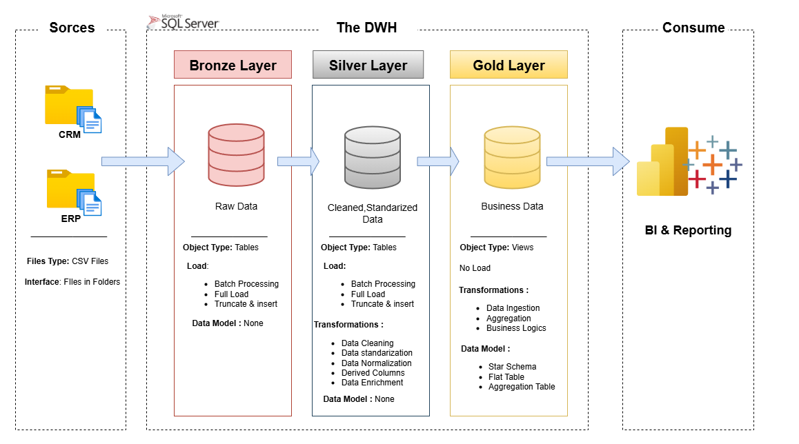
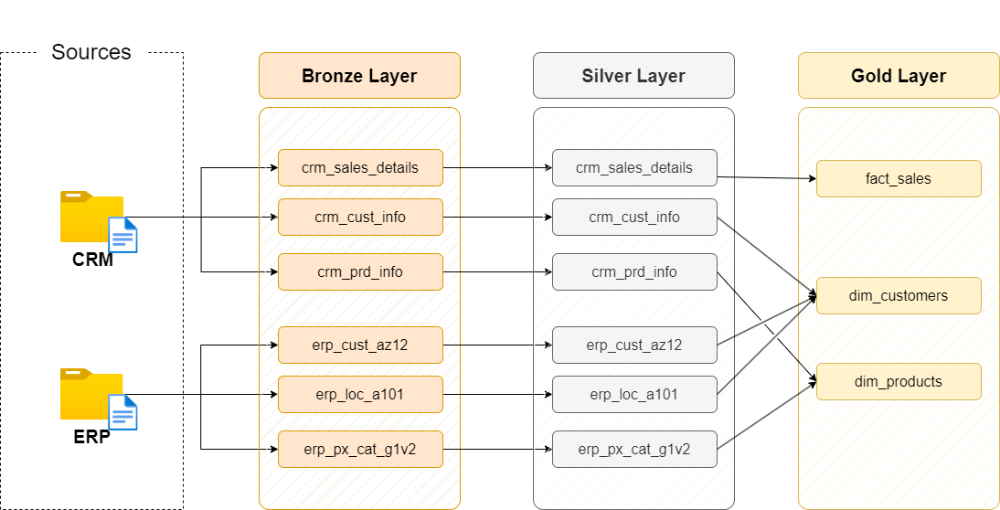
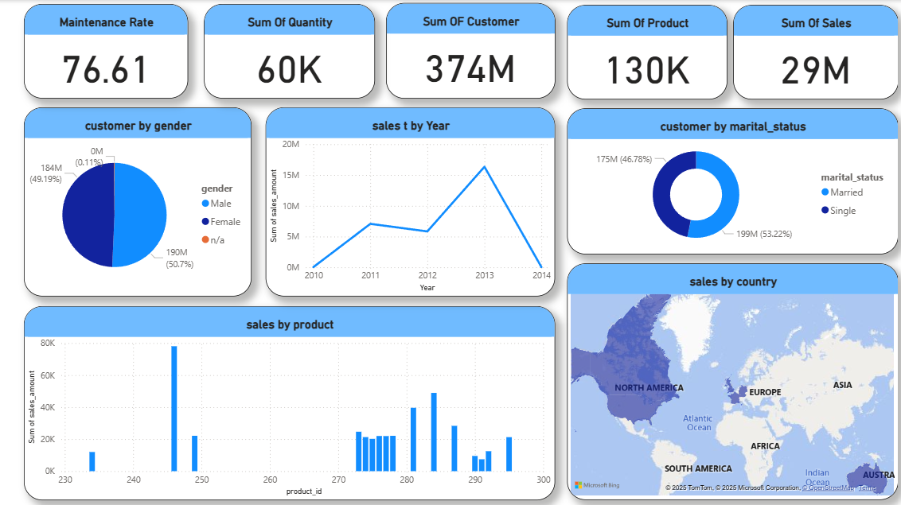

# Data Warehouse with ETL in SQL Server


This repository contains a modern end-to-end  Data Warehouse (DWH) project built with SQL Server following the Bronze → Silver → Gold layered architecture. It demonstrates how raw CRM and ERP data is ingested, cleaned, standardized, and transformed into business-ready analytical models for reporting and BI use cases.

---

## Project Overview


The DWH is designed using a 3-layered approach:

### Bronze Layer (Raw Data)

- Stores raw data directly from source systems (CRM & ERP).
- Data is ingested **as-is** for traceability.
- **Operations:**
  - Batch processing
  - Full load / truncate & insert

### Silver Layer (Cleaned Data)

- Contains **cleaned and standardized** data.
- **Applied transformations:**
  - Data cleaning
  - Data normalization
  - Data standardization
  - Derived columns
  - Data enrichment

### Gold Layer (Business Data)

- Provides **business-ready models** for analytics.
- **Designed as:**
  - **Star Schema** (Fact & Dimension tables)
  - Aggregation tables & business logic views
- Used for **BI & Reporting** in Power BI / Tableau.

---

## Architecture



---
## Data Flow



---
## Data Model


---
## Dashboards

Here is an example dashboard created using the Gold Layer:



Includes KPIs such as:
- Sales metrics  
- Customer insights  
- Maintenance performance  
- Aggregated business indicators

---
## Repository Structure

```

├── Docs/                      # Project documentation & diagrams
│   ├── Arch.png
│   ├── data_flow.png
│   ├── data_integration.png
│   ├── data_model.png
│   └── Dash.png
│
├── SQL Scripts/               # ETL SQL scripts for each layer
│   ├── Bronze Layer/
│   │   ├── DDL_Bronze.sql
│   │   └── Load FROM Source TO Bronze.sql
│   ├── Silver Layer/
│   │   ├── DDL_Silver.sql
│   │   └── Load FROM Bronze TO Silver.sql
│   └── Gold Layer/
│       └── Gold_Views.sql
│
├── Source Data/               # Raw input CSV files
│   ├── CRM
│   └── ERP
│
└── README.md

````
---
## How to Run

1. Clone the repository
```bash
git clone https://github.com/mahmoudgml/sql-dwh-etl.git
````

2. Set up SQL Server

   Create a database for the DWH layers.

3. Execute ETL scripts in order

   Bronze Layer → Silver Layer → Gold Layer.

4. Load source CSV files

   Import all files from the `Source Data` folder into their corresponding Bronze tables.

5. Run the queries in `Gold_Views.sql` to generate Fact & Dimension tables.

6. Connect BI tools

   Use Power BI or Tableau to connect to Gold Layer views and build dashboards.

---
## Contact

* **LinkedIn:**
  [https://www.linkedin.com/in/mahmoudgamalsaad](https://www.linkedin.com/in/mahmoudgamalsaad)

* **Email:**
  [mahmoud23456123@gmail.com](mailto:mahmoud23456123@gmail.com)
